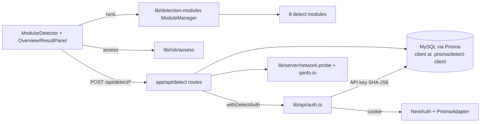

# AGENTS.md

This file provides guidance to Verdent when working with code in this repository.

## Table of Contents

1. Commonly Used Commands
2. High-Level Architecture & Structure
3. Key Rules & Constraints
4. Development Hints

## Commands

- `yarn dev` — Next.js dev server on `http://localhost:3000`.
- `yarn build` — production build; produces `.next/standalone` (required by `Dockerfile`).
- `yarn start` — run the built standalone server.
- `yarn lint` / `yarn lint:fix` — ESLint (`next/core-web-vitals` + prettier plugin).
- `yarn format` / `yarn format:check` — Prettier over `**/*.{js,jsx,ts,tsx,json,css,md}`.
- `yarn test` / `yarn test:watch` — Jest (`jsdom`, `ts-jest`, `testMatch: **/__tests__/**/*.test.(ts|tsx|js)`).
- Single test: `yarn test path/to/file.test.ts` or `yarn test -t "test name pattern"`.
- Type check: `npx tsc --noEmit` (no `typecheck` script).
- `yarn prisma:generate` — regenerate Prisma client to **custom path** `node_modules/.prisma/detect-client`.
- `yarn db:push` / `yarn db:push:force` — push schema to MySQL (no migrations folder; project uses `db push` exclusively).
- `yarn db:studio` — Prisma Studio.

## Architecture

- **Single Next.js 14 app (App Router) at repo root.** README's `yarn workspace app-detect …` examples are stale — there are no Yarn workspaces; just run `yarn <script>`. `[inferred]`
- **`app/`** — App Router routes; **every route is `force-dynamic`** (see `app/layout.tsx`) because `SessionProvider` needs a runtime session context. Marketing landing at `app/(marketing)/page.tsx`, detector UI at `app/app/page.tsx`, dashboards under `app/scans/*`, integrations at `app/integrations/*`.
- **`pages/`** — only `_app.tsx`, `_document.tsx`, `404.tsx`, `500.tsx`; exists solely as Pages-Router fallback for Next 14 error pages. Do not add new pages-router routes.
- **`app/api/*`** — route handlers (`runtime = 'nodejs'`, `dynamic = 'force-dynamic'`). Auth-gated routes go through `withDetectAuth` (`lib/api/auth.ts`), which accepts a Bearer `det_<hex>` API key **or** a NextAuth session cookie (in that order).
- **`components/`** — `modular-detector.tsx` is the top-level detector shell; `detector/`, `result-details/`, `overview/`, `auth/` are feature-grouped; `ui/` is shadcn/ui primitives.
- **`lib/detection-modules/`** — 8 client-side detection modules registered in `module-manager.ts` (network-probe, webrtc, browser-fingerprint, canvas-fingerprint, audio-fingerprint, font-detection, dns, cdp-detection). Each exports a `DetectionModule<T>` and is run via `ModuleManager.runAllEnabledModules()` with per-module error isolation.
- **`lib/risk/assess.ts`** — pure scoring function; takes `Messages` and per-module results, returns `OverallAssessment` (score, level, per-module signals). Called both client-side (for UI) and server-side (re-derived on save).
- **`lib/server/`** — Node-only helpers: `network-probe.ts` (server-observed IP/TLS/ASN via ipinfo.io), `api-key.ts` (SHA-256 hashing of `det_…` tokens), `rate-limit.ts` (in-process token bucket, single-pod only), `analytics.ts`, `send-email.ts` (Mailgun or dev-console).
- **`lib/i18n/`** — `en` (default) + `zh` messages; locale is read from cookie `leakish.locale` server-side and threaded into route handlers via `withDetectAuth`'s `m: Messages` argument.
- **Prisma / MySQL**: schema in `prisma/schema.prisma`. Client output is **`node_modules/.prisma/detect-client`** (not the default path) so it never collides with a sibling app's client. Imported via `lib/prisma.ts`. NextAuth tables (`User`/`Account`/`Session`/`VerificationToken`) plus business tables (`DetectScan`, `DetectFingerprintHash`, `ApiKey`).
- **Env**: validated lazily by Zod in `lib/env.ts`. `SKIP_ENV_VALIDATION=1` is honored (Docker build sets it with placeholders). Required: `DATABASE_URL`, `NEXTAUTH_SECRET` (≥32 chars), `GOOGLE_CLIENT_ID/SECRET`, `IP_HASH_SALT`. Optional: `IPINFO_TOKEN`, `TRUSTED_IP_HEADER`, Mailgun vars.
- **CI/CD** (`.github/workflows/deploy-tke.yml`): tag-driven deploys to Tencent TKE.
  - Tag `dev-tag/v*` → deploys to namespace `leakish-dev` (manifests in `k8s/dev/`).
  - Tag `v*` (not `dev-tag/v*`) → production (`leakish-prod`).
  - Branch `develop` → staging (`leakish-staging`).
  - Every deploy first runs `prisma db push --accept-data-loss` as a one-shot K8s `Job`.
- Image registry: `sgccr.ccs.tencentyun.com/<your-org>/leakish-web` (Tencent TCR).

## Key Rules & Constraints

- **No CLAUDE.md, `.cursor/rules/`, `.cursorrules`, or `.github/copilot-instructions.md`** in this repo.
- **From `README.md`**: app runs **fully client-side** for detection; only outbound calls from the detector itself are `stun:stun{,1-4}.l.google.com:19302` and `https://dns.google/resolve`. Module toggles persist in `localStorage` with a version key (`lib/persistence/module-config-storage.ts`).
- **From `CHANGELOG.md` (must-know gotchas)**:
  - Marketing landing **must** live under `app/(marketing)/` — a previous `app/page.tsx` + `app/app/page.tsx` collision caused a webpack module-ID hash clash on Node 22 alpine that silently routed `/` to the detector in prod builds. Do not move it back.
  - Risk-signal generation is locale-aware; `assess.ts` requires a `Messages` argument. Don't hardcode user-visible strings in module assessors — thread `Messages` through.
  - The AI assistant / OpenRouter integration was removed; do not reintroduce `OPENROUTER_*` env vars or LLM streaming routes without scope discussion.
- **Prisma client path**: imports must go through `lib/prisma.ts` / `@prisma/client` resolution that points at `node_modules/.prisma/detect-client`. Don't change the `output` in `schema.prisma`.
- **`force-dynamic` everywhere** — adding `revalidate` or trying to statically render any route under `app/` will reintroduce the `<Html>` / `useContext null` prerender crash. Leave `app/layout.tsx`'s `export const dynamic = 'force-dynamic'` in place.
- **Auth**: API key tokens are `det_<64 hex>`; only the SHA-256 is stored. `withDetectAuth` already updates `lastUsedAt` best-effort. Don't bypass it on new authed routes.
- **Idempotency**: `POST /api/detect/scans` honors the `Idempotency-Key` header (≤128 chars) via the `(userId, idempotencyKey)` unique index. Preserve this when modifying that route.
- **Rate limiting** is in-process only (`lib/server/rate-limit.ts`); upper bound is `limit × pod_count`. Don't rely on it for hard security guarantees.
- **Prettier**: single quotes, semicolons, `printWidth: 100`, `arrowParens: "avoid"`, `trailingComma: "es5"`. ESLint runs `prettier/prettier` as an error.
- **TS**: `strict: true`, path alias `@/*` → repo root. React 18.2.0 is pinned via `resolutions`; don't bump to 19 casually.

## Development Hints

- **Adding a new detection module**:
  1. Create `lib/detection-modules/<id>-module.ts` exporting a `DetectionModule<TData>` with a `<TData>` interface.
  2. Register it in `lib/detection-modules/module-manager.ts` (order = sidebar order).
  3. Add `<id>-result-detail.tsx` under `components/result-details/` and wire it into the typed switch in `components/result-details/index.tsx`.
  4. Add an icon mapping in `components/detector/icon-map.ts`.
  5. Extend `lib/risk/assess.ts` if the module should contribute risk signals (thread `Messages` for strings).
  6. If you need to persist module output: add columns to `DetectScan` in `prisma/schema.prisma`, update `lib/api/scan-payload.ts` (`ModuleSnapshotSchema`), and `yarn db:push`.
  7. Add tests under `lib/detection-modules/__tests__/`.
- **Adding a new API endpoint**:
  1. Create `app/api/<path>/route.ts` with `export const dynamic = 'force-dynamic'; export const runtime = 'nodejs';`.
  2. Wrap auth-required handlers in `withDetectAuth(req, async ({ user, m, source }) => …)`; return `NextResponse.json` with localized `message` strings from `m.apiErrors.*`.
  3. Validate request body with a Zod schema (see `lib/api/scan-payload.ts` for patterns: max sizes, optional fields, `.default({})`).
  4. If write-heavy and retryable, support `Idempotency-Key`. If high-rate, gate it through a limiter in `lib/server/rate-limit.ts`.
- **Modifying CI/CD**:
  - Edit `.github/workflows/deploy-tke.yml`. Test/lint/typecheck only runs on **pull_request**; tag pushes skip the `test` job.
  - To deploy without code changes, push a tag (`dev-tag/v*` for dev, `v*` for prod). `workflow_dispatch` is also available.
  - K8s manifests live in `k8s/dev/` only; staging/prod re-use the dev `deployment.yaml` shape but apply it implicitly via `kubectl set image` in the workflow. `[inferred]`
  - Pre-build Prisma generate is mandatory in CI (the runtime image expects the pre-generated client at `.prisma/detect-client`).
- **Extending i18n**:
  - Add keys to **both** `lib/i18n/en.ts` and `lib/i18n/zh.ts`; the `ZhMessages` type is the source of truth.
  - API error keys live under `messages.apiErrors`; UI strings under feature-scoped namespaces (`detector`, `overview`, `auth`, `email`, …).
- **Extending Prisma schema**: prefer additive changes (nullable columns) — there are no migrations, only `prisma db push`. Add targeted `@@index` only when a real query needs it (raw blob columns are intentionally unindexed).
- **Local dev with email magic-link**: skip Mailgun env vars and the magic link will be printed to the dev server console; in production missing Mailgun vars cause the login attempt to error (never silently no-op).
